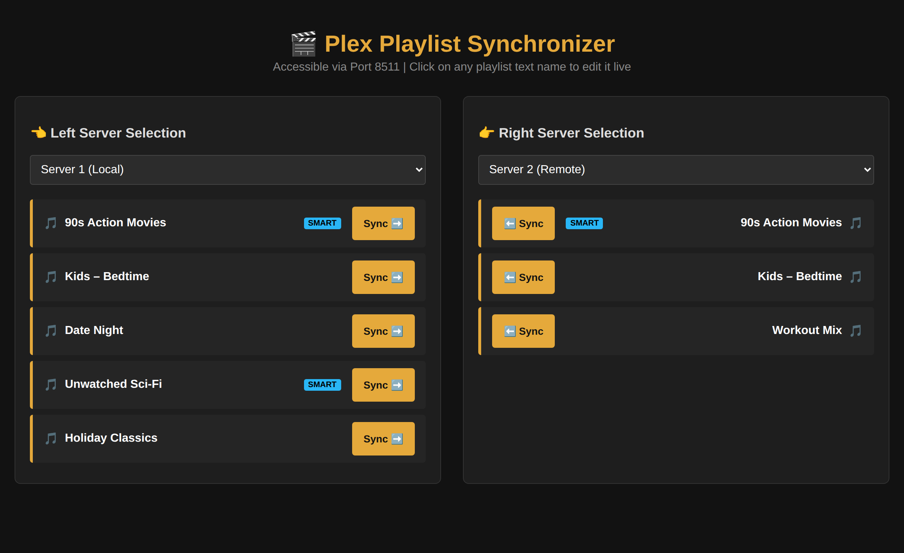

# 🎬 Plex Playlist Sync

A simple, self-hosted web app that lets you **view, rename, and copy playlists between multiple Plex Media Servers** — side by side, from your browser, in one click.

If you run more than one Plex server (a main one and a backup, a local and a remote, one for you and one for family), you've probably hit the annoying truth that **Plex has no built-in way to move a playlist from one server to another.** This tool fixes that.




---

## ✨ What it does

- **See two servers at once.** Pick any server on the left and any server on the right; their playlists show up in parallel columns.
- **Sync in one click.** Hit the **Sync** arrow to copy a playlist from one server to the other.
- **Handles smart playlists properly.** For a smart playlist, it recreates the actual *filter rules* on the target server (not just a frozen snapshot of the current items), so the playlist stays dynamic.
- **Handles regular (static) playlists too.** It matches each item by title in the target library and tells you if anything couldn't be found.
- **Rename playlists live.** Click a playlist's name, type a new one, and it saves back to Plex instantly.
- **Works with as many servers as you want.** Two, three, or more — you just list them in a config file.
- **Clean dark-mode interface** that runs entirely in your browser.

---

## 🧩 What you need (and what's optional)

### 🔴 Required — the app won't work without these
- **Python 3.8 or newer** installed on the computer you'll run this on. ([Download here](https://www.python.org/downloads/).)
- **At least one Plex Media Server** you control. (You need **two** for the whole point — syncing *between* servers — but the app runs fine with one for viewing/renaming.)
- **Your Plex authentication token(s).** This is how the app logs into your server. It's free and takes 30 seconds to find — see [How to find your Plex token](https://support.plex.tv/articles/204059436-finding-an-authentication-token-x-plex-token/). Each server you add needs its token.
- **Network access to each server.** The computer running this app has to be able to reach each Plex server's address (local IP for local servers, or a public/remote address for remote ones).

### 🟢 Optional — nice to have, not required
- **Matching libraries on both servers.** Syncing works best when both servers actually contain the same media. For a *static* playlist, any item the target server doesn't have is simply skipped (and reported to you). For a *smart* playlist, the target just needs a library of the same **type** (e.g. a Movies library) — the rules do the rest.
- **A second (or third) server.** With only one server you can still view and rename playlists; you need a second to actually sync between them.

> There are **no paid services, API keys, or cloud accounts** involved. Everything runs locally on your own machine and talks directly to your own Plex servers.

---

## 🚀 Quick start (the easy way)

**On Mac:**
1. Download this project (green **Code** button above → **Download ZIP**) and unzip it.
2. Double-click **`install-mac.command`**. *(First time only: right-click it → **Open** → **Open** to get past macOS's security warning.)*
3. Open the newly created **`.env`** file in a text editor and fill in your Plex server details (see [Configuration](#-configuration) below).
4. Double-click **`start-mac.command`**.
5. Open **http://localhost:8511** in your browser. 🎉

**On Windows:**
1. Download and unzip the project.
2. Double-click **`install-windows.bat`**.
3. Open the newly created **`.env`** file in Notepad and fill in your Plex server details.
4. Double-click **`start-windows.bat`**.
5. Open **http://localhost:8511** in your browser. 🎉

Prefer to do it by hand, or on Linux? See **[INSTALL.md](INSTALL.md)** for full step-by-step instructions and troubleshooting.

---

## ⚙️ Configuration

All your settings live in a file called **`.env`** (the installer creates it for you from `.env.example`). Open it and fill in a block for each Plex server:

```env
WEB_PORT=8511

PLEX_SERVER_1_NAME=Server 1 (Local)
PLEX_SERVER_1_URL=http://192.168.1.10:32400
PLEX_SERVER_1_TOKEN=your_plex_token_here

PLEX_SERVER_2_NAME=Server 2 (Remote)
PLEX_SERVER_2_URL=http://192.168.1.20:32400
PLEX_SERVER_2_TOKEN=your_plex_token_here
```

- **`NAME`** is just a friendly label you'll see in the dropdown.
- **`URL`** is your server's address followed by `:32400` (Plex's port).
- **`TOKEN`** is your Plex token — [here's how to find it](https://support.plex.tv/articles/204059436-finding-an-authentication-token-x-plex-token/).
- Add more servers by copying a block and bumping the number (`PLEX_SERVER_3_...`, and so on).

Your `.env` file stays on your computer and is **never** shared or uploaded.

---

## 🔒 A note on security

This app is designed to run on your **own trusted home network**. A few things to know:

- **It has no login/password of its own.** Anyone who can reach the address can use it, so don't expose it directly to the public internet. Keep it on your LAN, or put it behind a VPN/reverse proxy if you need remote access.
- To lock it to only the computer it runs on, set `HOST=127.0.0.1` in your `.env`.
- It intentionally **skips SSL certificate checks**, which is what lets it talk to Plex servers by raw IP address. That's normal for local Plex use.
- Keep **debug mode off** (`FLASK_DEBUG=false`, the default) unless you're actively troubleshooting.

---

## 🤔 How syncing works (quick version)

When you click **Sync**, the app:
1. Reads the chosen playlist from the source server.
2. Deletes any playlist of the same name already on the target (so you get a clean copy).
3. **If it's a smart playlist:** it copies the filter rules and sort order and rebuilds them on the target server against a library of the matching type.
4. **If it's a static playlist:** it searches the target library for each item by title, adds the ones it finds, and reports any it couldn't (e.g. media the target server doesn't have).

---

## 🛠️ Troubleshooting

The most common issues (Python not found, "no playlists," connection errors, the Mac security warning) are all covered in detail in **[INSTALL.md](INSTALL.md#troubleshooting)**. If you hit something not covered there, feel free to open an Issue on this repo.

---

## 🤝 Contributing

Ideas, bug reports, and pull requests are welcome. If you found a bug, open an Issue with what you did and what happened. If you'd like to add a feature, feel free to fork and send a PR.

---

## 📄 License

Released under the **MIT License** — free to use, modify, and share. See [LICENSE](LICENSE).

---

## ☕ Support

I build and share these tools for free in my spare time. If this saved you some hassle and you'd like to say thanks, you can **[buy me a coffee](https://buymeacoffee.com/joed1986)** — it's genuinely appreciated and helps me keep making stuff like this. Either way, enjoy! 🙌
